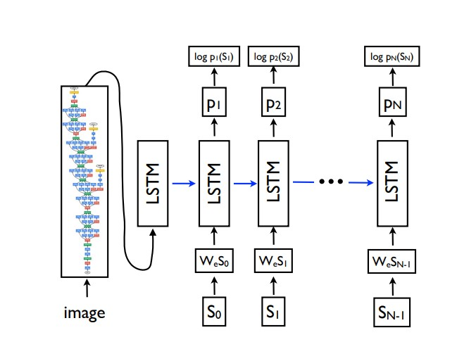

# Image 📷 Captioning with PyTorch

This project is based on the [**Show and Tell**](https://arxiv.org/abs/1411.4555) Paper for Image Captioning using Neural Networks.

Th idea behind show and tell (image captioning) is that the neural network is shown an image and the relevant caption is generated for the image. For this the image is first passed on to a `CNN` such as a `ResNet` or `VGG Net` to learn `features` from the image and then the output from the `convolutional layers` from this networks is passed onto `RNN` layers such as `LSTM` or `GRU` to generate a sequence of words (sentences) that best describes the Image. 

Both the `CNN` and `RNN` models are created separately and then they are combined to get a single model that learn both Image features using CNN and uses true captions and a method called `teacher forcing` to learn relevant output captions for a given image. What teacher enforcing does is that the model uses the ground truth from a prior time step as input which allows the RNN model to stay as close to the ground-truth as possible.

We will be using a pretrained network for our `CNN` as they are already trained on large corpus of dataset and already have learned features from millions of images. We just need to use the output from the last `Convolutional Layers` and feed that feature vector to `RNN`. 

This model architecture can be better `visualised` (this image is from the original Show and Tell Paper):

The Dataset used to train the model is the [**`Flickr8K`**](https://www.kaggle.com/datasets/adityajn105/flickr8k) dataset. This dataset containes images as well as ground-truth captions from `Flickr`. YOu can use open datasets, but the more amount of images you have, the more it will take to train your model.

The model was trained on `Google Colab` and was written in `PyTorch`. So, you need to write all the training loops as well as create classes and functions to prepare the dataset for training by creating `DataLoader`. It was trained for 20 epochs, so the results will not be great, but it has started to learn to describe the image fairly well. I would suggest training for at-least 100 epochs to see some better results. I have seen people train for around 100 epochs to get some good results. But 20 should work to get a grasp of how things are working.

🔴 The paper is really well written and easy to read. I would suggest going through the apper once to get a better idea of all the concepts and then jump back to the code.